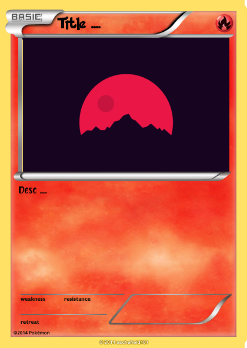
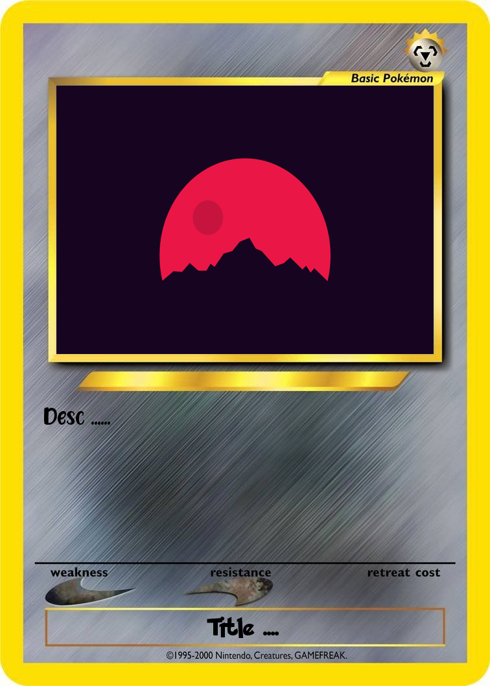
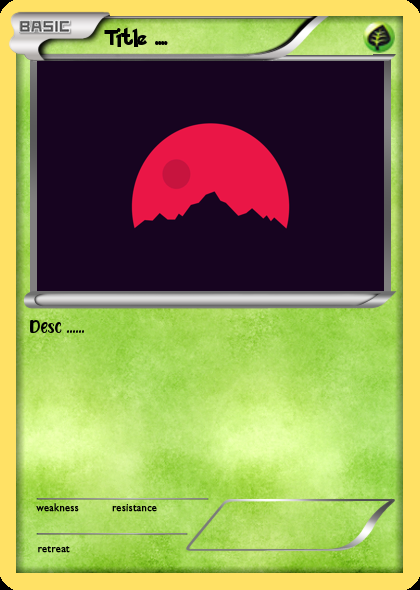
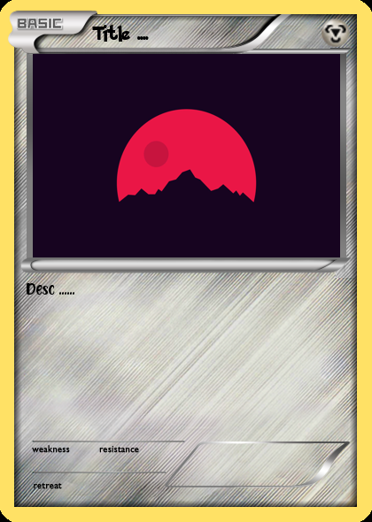

<p align="center">

</p>

# Pokemon Card
# Install This Library

```
$ git clone https://github.com/krypton-byte/pocard
$ cd pocard && python3 setup.py build && python3 setup.py install --user
```
# Use
<p>CommandLine<p>

```bash
$ pocard index[0-3] "title" "desc" input_image output_image method:[scale, crop, auto]
example:
$ pocard 0 "Title" "desc" in.png out.jpg scale
```

<p>Python Interpreter</p>

```python
>>> from pocard import CARDS
>>> CARDS[0].maker("Title", "image_input.png", "Desk", font_color=(0, 0, 0), image_method="auto").show()
>>> CARDS[0].maker("Title", "image_input.png", "Desk", font_color=(0, 0, 0), image_method="auto").save("out.png)
# image_input type: BytesIO, Image.open Object, string(path+filename)
# image_merhod: scale, auto, crop
```
# Preview

# Donasi
<p align="center">

</p>
<ul><li><a href="https://saweria.co/kryptonbyte">Saweria</a><li><a href="https://wa.me/6283172366463">Whatsapp</a></li><li><a href="https://trakteer.id/krypton-byte-z8vbo">Trakteer</a></li></ul>